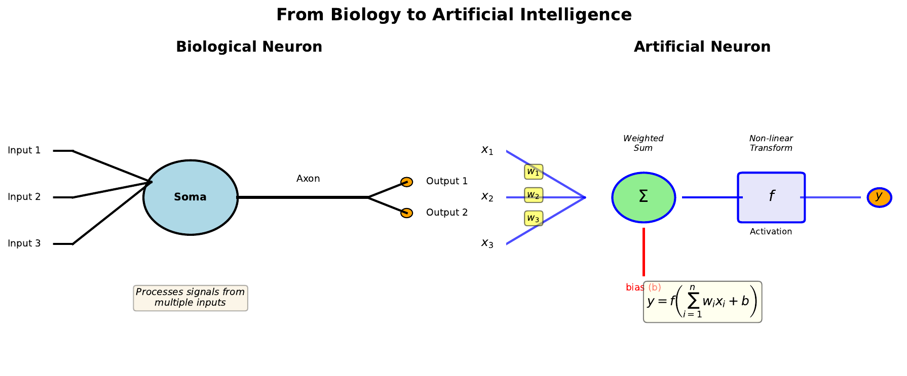

# Biological vs Artificial Neuron

---

## Learning Goal

Understand how biological neurons inspire the mathematical structure of artificial neurons.

---

## Key Concept

The human brain contains approximately 86 billion neurons, each connected to thousands of others. These biological neurons receive signals through tree-like structures called **dendrites**, process them in the cell body (**soma**), and transmit outputs through a long fiber called the **axon** to other neurons via **synapses**.

Artificial neurons mimic this process mathematically. Instead of electrical signals traveling through dendrites, we have numerical inputs. Instead of synaptic strengths that change with learning, we have **weights** that adjust during training. The soma's signal integration becomes a **weighted sum**, and the axon's firing decision becomes an **activation function**.

This biological analogy is not just poetic - it guided the development of neural networks and helps us understand why they work. Just as biological neurons strengthen connections that lead to successful outcomes, artificial neurons adjust their weights to minimize prediction errors.

---

## Visual

---

## Key Formula

The artificial neuron computes:

$$y = f\left(\sum_{i=1}^{n} w_i x_i + b\right)$$

Where:
- **x_i** = input values (like dendrite signals)
- **w_i** = weights (like synaptic strengths)
- **b** = bias (baseline activation threshold)
- **f** = activation function (like the firing decision)
- **y** = output (like the axon signal)

---

## Intuitive Explanation

Think of a neuron as a voting system. Each input casts a vote (x_i), but not all votes are equal - some have more influence (w_i). The neuron tallies the weighted votes, adds a baseline preference (b), and then decides whether to "fire" based on the total.

If the weighted sum exceeds a threshold, the neuron produces a strong output. If it falls below, the output is weak. This simple mechanism, repeated across millions of neurons, creates the complex behaviors we see in neural networks.

---

## Practice Problems

### Problem 1
A neuron receives three inputs: x1 = 0.5, x2 = 0.8, x3 = 0.2. The weights are w1 = 0.4, w2 = 0.3, w3 = 0.5, and the bias is b = -0.1. Calculate the weighted sum z.

Solution

$$z = w_1 x_1 + w_2 x_2 + w_3 x_3 + b$$
$$z = (0.4)(0.5) + (0.3)(0.8) + (0.5)(0.2) + (-0.1)$$
$$z = 0.20 + 0.24 + 0.10 - 0.10$$
$$z = 0.44$$

### Problem 2
In the biological neuron, what structure is analogous to the weights in an artificial neuron? Explain why this analogy makes sense.

Solution

The **synaptic strengths** are analogous to weights. This makes sense because:
- Synapses can be strong or weak, just like weights can be large or small
- Synaptic strengths change with learning (long-term potentiation/depression)
- A strong synapse means that input has more influence on the neuron's output
- Both determine how much each input contributes to the final decision

### Problem 3
If all weights in a neuron are set to zero, what would be the output regardless of inputs (assuming bias = 0)?

Solution

The weighted sum would be:
$$z = 0 \cdot x_1 + 0 \cdot x_2 + ... + 0 \cdot x_n + 0 = 0$$

The output would be f(0), which depends on the activation function:
- For sigmoid: f(0) = 0.5
- For ReLU: f(0) = 0
- For tanh: f(0) = 0

The neuron would be "deaf" to all inputs and produce a constant output.

---

## Key Takeaways

- Biological neurons inspire artificial neuron design
- Dendrites -> Inputs, Synapses -> Weights, Soma -> Summation, Axon -> Output
- The weighted sum aggregates all inputs before the activation decision
- Learning adjusts weights, similar to how synapses strengthen or weaken
