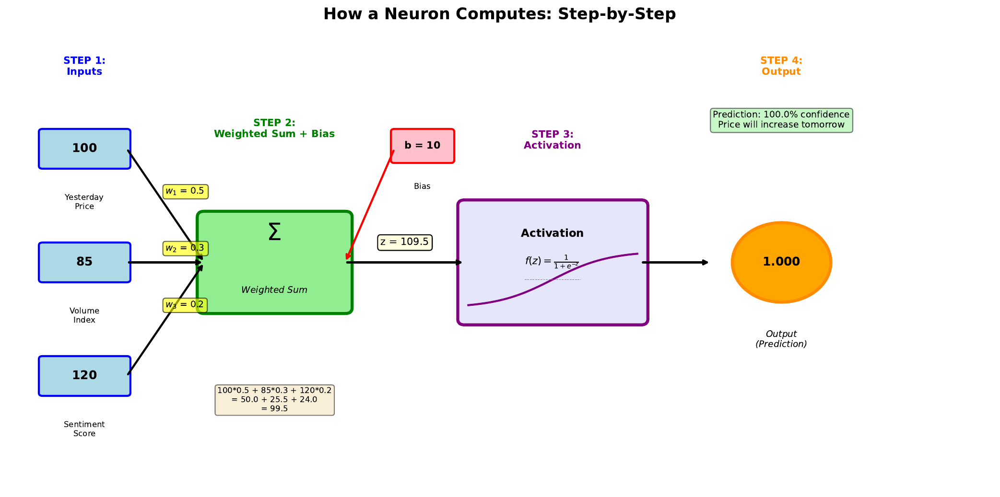

# Single Neuron Computation

---

## Learning Goal

Calculate the output of an artificial neuron step by step using concrete numbers.

---

## Key Concept

A single neuron performs two operations in sequence: first a **weighted sum**, then an **activation function**. Understanding this two-step process is essential for grasping how neural networks work.

**Step 1: Weighted Sum** - The neuron multiplies each input by its corresponding weight, sums all these products, and adds the bias. This produces a single number called the "pre-activation" value (often denoted z).

**Step 2: Activation** - The pre-activation value passes through an activation function (like sigmoid) that squashes it into a useful range. For the sigmoid function, any input is transformed to a value between 0 and 1, which we can interpret as a probability.

In business applications, we might use this to predict whether a stock price will rise. The inputs could be yesterday's price change, trading volume, and market sentiment. The output probability tells us the network's confidence in a price increase.

---

## Visual

---

## Key Formula

**Step 1: Weighted Sum**
$$z = w_1 x_1 + w_2 x_2 + w_3 x_3 + b$$

**Step 2: Sigmoid Activation**
$$y = \sigma(z) = \frac{1}{1 + e^{-z}}$$

Where:
- **z** = pre-activation (weighted sum)
- **y** = output probability (between 0 and 1)
- **e** = Euler's number (approximately 2.718)

---

## Intuitive Explanation

Think of the weighted sum as a "score" that combines all available information. A high positive score suggests the answer is likely "yes" (price will rise), while a negative score suggests "no."

The sigmoid function converts this unbounded score into a probability. No matter how extreme the score, the output stays between 0 and 1. A score of 0 gives exactly 0.5 (50-50 chance). Positive scores give probabilities above 0.5, negative scores below.

---

## Practice Problems

### Problem 1
Given inputs Price = 1.2, Volume = 0.8, Sentiment = 0.6, with weights w1 = 0.5, w2 = 0.3, w3 = 0.4 and bias b = -0.5, calculate the weighted sum z.

Solution

$$z = w_1 \cdot \text{Price} + w_2 \cdot \text{Volume} + w_3 \cdot \text{Sentiment} + b$$
$$z = (0.5)(1.2) + (0.3)(0.8) + (0.4)(0.6) + (-0.5)$$
$$z = 0.60 + 0.24 + 0.24 - 0.50$$
$$z = 0.58$$

### Problem 2
Using z = 0.58 from Problem 1, calculate the sigmoid output. What is the predicted probability of price increase?

Solution

$$y = \frac{1}{1 + e^{-0.58}}$$

First calculate e^(-0.58):
$$e^{-0.58} \approx 0.560$$

Then:
$$y = \frac{1}{1 + 0.560} = \frac{1}{1.560} \approx 0.641$$

The neuron predicts a **64.1% probability** of price increase.

Since 0.641 > 0.5, the prediction would be "BUY" (price likely to rise).

### Problem 3
What weighted sum z would give exactly 50% probability (y = 0.5)?

Solution

We need to find z such that:
$$\frac{1}{1 + e^{-z}} = 0.5$$

Solving:
$$1 = 0.5(1 + e^{-z})$$
$$2 = 1 + e^{-z}$$
$$e^{-z} = 1$$
$$-z = \ln(1) = 0$$
$$z = 0$$

When **z = 0**, the sigmoid output is exactly 0.5. This is the decision boundary - the point of maximum uncertainty.

---

## Key Takeaways

- Neuron computation has two steps: weighted sum, then activation
- The weighted sum can be any real number (positive, negative, or zero)
- Sigmoid squashes the weighted sum to a probability between 0 and 1
- z = 0 corresponds to 50% probability (maximum uncertainty)
