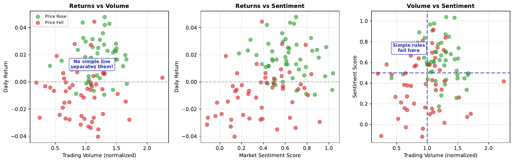

# Problem Visualization

---

## Learning Goal

Visualize why complex market data cannot be separated by simple linear rules.

---

## Key Concept

When we plot market features against each other (returns vs volume, sentiment vs volatility), we often see **overlapping clusters** rather than clean separations. Days when the market went up (one class) are scattered throughout the same regions as days when it went down (other class).

This overlap explains why simple rules fail. "Buy when volume is high" doesn't work because high volume days include both winners and losers. The relationship between features and outcomes is **non-linear** - success depends on complex combinations of factors, not single thresholds.

Neural networks excel at finding these complex, non-linear patterns. They can learn decision boundaries that curve through the data, separating classes that no straight line could divide.

---

## Visual

---

## Key Formula

**Linear decision boundary attempt:**
$$w_1 \cdot \text{returns} + w_2 \cdot \text{volume} + b = 0$$

This defines a straight line in feature space, but for overlapping data, no such line achieves good separation.

**Classification error:**
$$\text{Error} = \frac{\text{Misclassified Points}}{\text{Total Points}}$$

---

## Intuitive Explanation

Imagine sorting marbles by color when red and blue marbles are thoroughly mixed together in a pile. You can't draw a single straight line through the pile to separate them - wherever you draw the line, some marbles of each color end up on the wrong side.

Market data is similar: "up" days and "down" days are interspersed throughout feature space. Simple rules (like "buy when sentiment is positive") misclassify many examples because the relationship is more complex.

---

## Practice Problems

### Problem 1
You plot 100 trading days: 50 "up" days and 50 "down" days. When Volume > 0.6, you find 30 up days and 25 down days. Is "Volume > 0.6 predicts up" a good rule?

Solution

Above threshold (Volume > 0.6):
- Up days: 30
- Down days: 25
- Total: 55

Accuracy of "predict UP when Volume > 0.6":
$$\text{Accuracy} = \frac{30}{55} = 54.5\%$$

Below threshold (Volume <= 0.6):
- Up days: 50 - 30 = 20
- Down days: 50 - 25 = 25
- Total: 45

If we predict DOWN below threshold:
$$\text{Accuracy} = \frac{25}{45} = 55.6\%$$

**Overall accuracy: (30 + 25) / 100 = 55%**

This is only slightly better than chance (50%). The rule captures some signal but leaves much unexplained. **Not a good rule** - the overlap is too significant.

### Problem 2
Why might the combination of volume AND sentiment predict better than either alone?

Solution

**Interaction effects** between features can be more predictive than individual features:

1. **High volume + positive sentiment**: Strong buying pressure, likely UP

2. **High volume + negative sentiment**: Strong selling pressure, likely DOWN

3. **Low volume + positive sentiment**: Weak signal, uncertain

4. **Low volume + negative sentiment**: Weak signal, uncertain

Neither feature alone captures this pattern:
- High volume alone? Could be buying OR selling
- Positive sentiment alone? Could be acted upon OR ignored

The **combination** reveals the true signal. This is exactly what neural networks learn - complex interactions between features that simple rules miss.

### Problem 3
If classes overlap completely (50% of each class in every region), what is the maximum possible accuracy?

Solution

If classes overlap completely, the data is **purely random** - no feature contains any predictive information.

Maximum accuracy = **50%** (random guessing)

No matter what rule or model you use:
- Any region you predict "UP" has 50% UP, 50% DOWN
- Any region you predict "DOWN" has 50% UP, 50% DOWN

This represents the **Bayes error rate** - the theoretical minimum error when classes are inseparable.

Real markets are not completely random, so some predictive power is possible. But regions of complete overlap limit accuracy for any model.

---

## Key Takeaways

- Market data often shows overlapping classes in feature space
- Simple linear rules fail when data is non-linearly separable
- Plotting features reveals the complexity of the classification problem
- Neural networks can learn non-linear boundaries through overlapping regions
- Complete overlap = unpredictable; partial overlap = opportunity for learning
