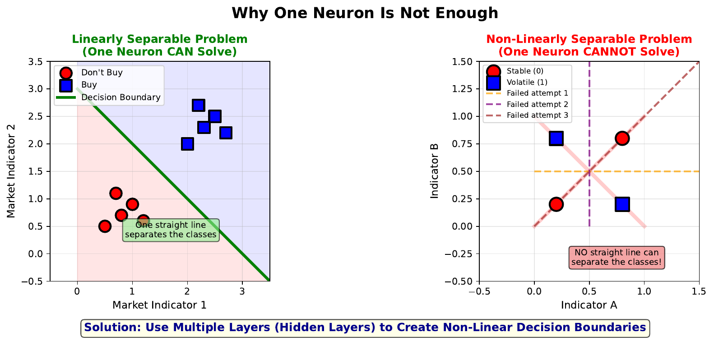

# Linear Limitation (The XOR Problem)

---

## Learning Goal

Understand why a single neuron cannot solve non-linearly separable problems like XOR.

---

## Key Concept

A single neuron with linear activation can only create a **straight line** (or hyperplane) to separate data into two categories. This works perfectly when data can be divided by a straight line - called "linearly separable" problems.

However, many real-world problems are **non-linearly separable**. The classic example is XOR (exclusive or): output is 1 when exactly one input is 1, but 0 when both inputs are the same. No single straight line can separate XOR's four points correctly.

This fundamental limitation motivated the development of **multi-layer networks**. By stacking neurons in layers, each with non-linear activation functions, networks can learn curved decision boundaries that separate complex patterns.

The XOR problem was historically important - in 1969, Minsky and Papert showed that single-layer perceptrons couldn't solve XOR, which temporarily dampened enthusiasm for neural networks. The solution came with backpropagation and hidden layers in the 1980s.

---

## Visual

---

## Key Formula

A single neuron defines a linear decision boundary:

$$w_1 x_1 + w_2 x_2 + b = 0$$

Points are classified as:
- **Class 1** if $w_1 x_1 + w_2 x_2 + b > 0$
- **Class 0** if $w_1 x_1 + w_2 x_2 + b < 0$

This equation describes a straight line in 2D (or hyperplane in higher dimensions).

---

## Intuitive Explanation

Imagine trying to separate red and blue marbles on a table using only a straight ruler. If you can place the ruler so all red marbles are on one side and all blue on the other, the problem is linearly separable.

Now imagine four marbles arranged in a square: two diagonal marbles are red, two are blue. No matter how you place a single ruler, you'll always have at least one marble on the wrong side. This is the XOR pattern.

The solution? Use **two rulers** (two neurons in a hidden layer) to create a more complex boundary. Together, they can isolate the diagonal patterns that one ruler cannot.

---

## Practice Problems

### Problem 1
Consider the AND function: output is 1 only if both inputs are 1. The four input combinations are (0,0)->0, (0,1)->0, (1,0)->0, (1,1)->1. Is this linearly separable? Can you find weights and bias that work?

Solution

**Yes, AND is linearly separable.**

The point (1,1) must be on one side, and (0,0), (0,1), (1,0) on the other.

One solution: w1 = 1, w2 = 1, b = -1.5

Check:
- (0,0): 1(0) + 1(0) - 1.5 = -1.5 < 0 -> Class 0 (correct)
- (0,1): 1(0) + 1(1) - 1.5 = -0.5 < 0 -> Class 0 (correct)
- (1,0): 1(1) + 1(0) - 1.5 = -0.5 < 0 -> Class 0 (correct)
- (1,1): 1(1) + 1(1) - 1.5 = 0.5 > 0 -> Class 1 (correct)

A single neuron can solve AND.

### Problem 2
Now consider XOR: (0,0)->0, (0,1)->1, (1,0)->1, (1,1)->0. Try to find weights and bias that separate the classes. Why is this impossible?

Solution

**XOR is NOT linearly separable.**

We need:
- (0,0) and (1,1) on one side (Class 0)
- (0,1) and (1,0) on the other side (Class 1)

The Class 1 points are diagonally opposite! Any line separating (0,1) from (0,0) would also separate (1,0) from (1,1), but (0,0) and (1,1) should be together.

No single straight line can achieve this - the classes are "interleaved" diagonally.

This is why XOR requires at least 2 neurons in a hidden layer.

### Problem 3
In stock market prediction, why might the relationship between features and price direction be non-linearly separable?

Solution

Market data is rarely linearly separable because:

1. **Non-linear relationships**: High volume might predict "up" when sentiment is positive, but "down" when sentiment is negative

2. **Interactions**: The effect of one feature depends on others (like XOR)

3. **Regime changes**: The same signal might mean different things in bull vs bear markets

4. **Noise**: Random fluctuations blur boundaries between classes

5. **Complex patterns**: Markets exhibit momentum, mean reversion, and other non-linear dynamics

This is exactly why neural networks (with hidden layers) are useful for financial prediction - they can learn these curved, complex decision boundaries.

---

## Key Takeaways

- A single neuron can only create linear (straight) decision boundaries
- XOR is the classic example of a non-linearly separable problem
- Most real-world problems (including financial prediction) are non-linear
- Solution: Use multiple neurons in hidden layers with non-linear activation
