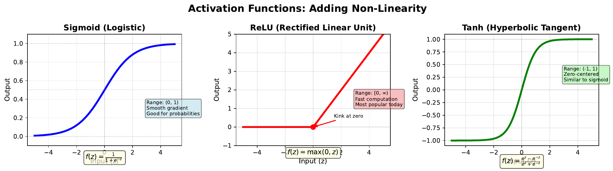

# Activation Functions

---

## Learning Goal

Compare different activation functions and understand when to use each one.

---

## Key Concept

Activation functions are the "decision makers" of neural networks. They take the weighted sum and transform it into an output. Without activation functions, neural networks would only compute linear combinations - no matter how many layers, the result would be equivalent to a single layer.

**Sigmoid** outputs values between 0 and 1, making it ideal for probabilities. However, it suffers from the "vanishing gradient" problem in deep networks.

**ReLU (Rectified Linear Unit)** is the most popular choice for hidden layers. It outputs zero for negative inputs and passes positive inputs unchanged. Simple, fast, and effective.

**Tanh** outputs values between -1 and 1, making it zero-centered. This can help with optimization in some cases.

The choice of activation function significantly impacts training speed and network performance. Modern networks typically use ReLU for hidden layers and sigmoid or softmax for output layers.

---

## Visual

---

## Key Formulas

**Sigmoid:**
$$\sigma(z) = \frac{1}{1 + e^{-z}} \quad \text{Range: } (0, 1)$$

**ReLU:**
$$\text{ReLU}(z) = \max(0, z) \quad \text{Range: } [0, \infty)$$

**Tanh:**
$$\tanh(z) = \frac{e^z - e^{-z}}{e^z + e^{-z}} \quad \text{Range: } (-1, 1)$$

---

## Intuitive Explanation

Think of activation functions as different voting rules:

- **Sigmoid**: "How confident are you on a scale of 0% to 100%?"
- **ReLU**: "If negative, stay silent. If positive, speak up proportionally."
- **Tanh**: "Express enthusiasm (+1) or skepticism (-1), with neutrality at 0."

ReLU's simplicity (just check if positive) makes it computationally efficient. Sigmoid and tanh are smooth but can "saturate" - when inputs are very large or very small, the output barely changes, making learning slow.

---

## Practice Problems

### Problem 1
Calculate the output of each activation function for z = 2.0.

Solution

**Sigmoid:**
$$\sigma(2.0) = \frac{1}{1 + e^{-2}} = \frac{1}{1 + 0.135} = \frac{1}{1.135} \approx 0.881$$

**ReLU:**
$$\text{ReLU}(2.0) = \max(0, 2.0) = 2.0$$

**Tanh:**
$$\tanh(2.0) = \frac{e^2 - e^{-2}}{e^2 + e^{-2}} = \frac{7.389 - 0.135}{7.389 + 0.135} = \frac{7.254}{7.524} \approx 0.964$$

### Problem 2
Calculate the output of each activation function for z = -1.5.

Solution

**Sigmoid:**
$$\sigma(-1.5) = \frac{1}{1 + e^{1.5}} = \frac{1}{1 + 4.482} = \frac{1}{5.482} \approx 0.182$$

**ReLU:**
$$\text{ReLU}(-1.5) = \max(0, -1.5) = 0$$

**Tanh:**
$$\tanh(-1.5) = \frac{e^{-1.5} - e^{1.5}}{e^{-1.5} + e^{1.5}} = \frac{0.223 - 4.482}{0.223 + 4.482} = \frac{-4.259}{4.705} \approx -0.905$$

### Problem 3
Why might ReLU cause "dead neurons" in a network? What happens if z is always negative for a particular neuron?

Solution

If z is always negative for a neuron:
- ReLU output is always 0
- The neuron contributes nothing to the network's output
- During backpropagation, the gradient through this neuron is also 0
- The weights leading to this neuron never update
- The neuron is permanently "dead" and cannot recover

This is called the **dying ReLU problem**. Solutions include:
- Using Leaky ReLU: f(z) = max(0.01z, z)
- Careful weight initialization
- Lower learning rates

---

## Key Takeaways

- Activation functions add non-linearity, enabling complex pattern learning
- Sigmoid: Good for output probabilities, but can saturate
- ReLU: Fast and effective, but can "die" with negative inputs
- Tanh: Zero-centered, but also saturates at extremes
- Modern networks typically use ReLU for hidden layers
