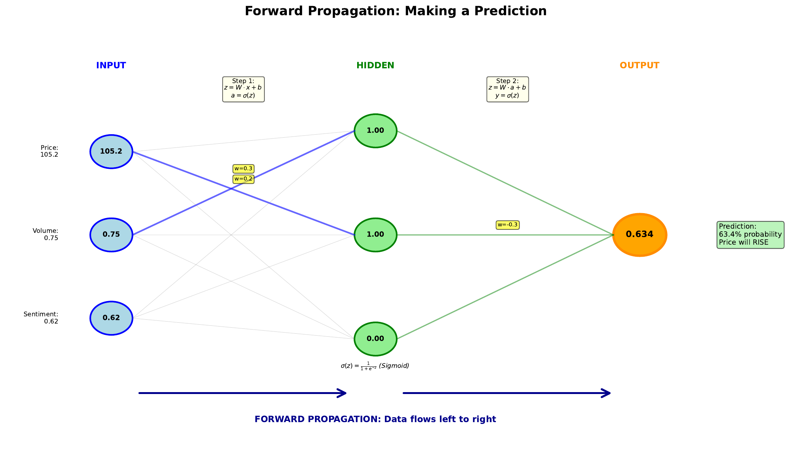

# Forward Propagation

[Back to Home](../index.html)

---

## Learning Goal

Trace how input data flows through a neural network to produce a prediction.

---

## Key Concept

**Forward propagation** is the process of computing a network's output given an input. Data flows forward from input layer through hidden layers to the output layer - hence the name.

At each layer, we perform two operations:
1. **Linear transformation**: Multiply inputs by weights and add bias (z = Wx + b)
2. **Non-linear activation**: Apply activation function (a = f(z))

The output of one layer becomes the input to the next. When data reaches the output layer, we have our prediction. During training, we compare this prediction to the true value to calculate error.

For a trading application, forward propagation answers: "Given today's market data, what does the network predict about tomorrow's price?"

---

## Visual

---

## Key Formulas

**Hidden layer computation:**
$$z^{[1]} = W^{[1]} x + b^{[1]}$$
$$a^{[1]} = \sigma(z^{[1]})$$

**Output layer computation:**
$$z^{[2]} = W^{[2]} a^{[1]} + b^{[2]}$$
$$\hat{y} = \sigma(z^{[2]})$$

Where:
- **x** = input features
- **W^[l]** = weight matrix for layer l
- **b^[l]** = bias vector for layer l
- **z^[l]** = pre-activation values
- **a^[l]** = activation values (layer output)
- **y-hat** = predicted output

---

## Intuitive Explanation

Imagine a relay race where each runner transforms the baton before passing it:

1. **Start**: Raw market data (price = 105.2, volume = 0.75, sentiment = 0.62)
2. **Hidden layer**: Each neuron "weighs" this data, adds its perspective, and outputs a transformed signal
3. **Output layer**: The final neuron combines all hidden signals into a single prediction
4. **Finish**: Probability of price increase (e.g., 74.2%)

The weights determine how much each neuron "listens" to each input. Training adjusts these weights to improve predictions.

---

## Practice Problems

### Problem 1
A network has 2 inputs, 2 hidden neurons, and 1 output. Given:
- Input: x = [1.0, 0.5]
- Hidden weights: W1 = [[0.2, 0.4], [0.6, 0.3]]
- Hidden bias: b1 = [0.1, -0.1]

Calculate z1 (pre-activation for hidden layer).

Solution

For hidden neuron 1:
$$z_1^{[1]} = 0.2(1.0) + 0.4(0.5) + 0.1 = 0.2 + 0.2 + 0.1 = 0.5$$

For hidden neuron 2:
$$z_2^{[1]} = 0.6(1.0) + 0.3(0.5) + (-0.1) = 0.6 + 0.15 - 0.1 = 0.65$$

**z1 = [0.5, 0.65]**

### Problem 2
Continuing from Problem 1, apply sigmoid activation to get a1 (hidden layer output).

Solution

$$a_1^{[1]} = \sigma(0.5) = \frac{1}{1+e^{-0.5}} = \frac{1}{1+0.607} = 0.622$$

$$a_2^{[1]} = \sigma(0.65) = \frac{1}{1+e^{-0.65}} = \frac{1}{1+0.522} = 0.657$$

**a1 = [0.622, 0.657]**

### Problem 3
Complete the forward pass. Given output weights W2 = [0.5, 0.7] and bias b2 = -0.3, calculate the final prediction.

Solution

$$z^{[2]} = 0.5(0.622) + 0.7(0.657) + (-0.3)$$
$$z^{[2]} = 0.311 + 0.460 - 0.3 = 0.471$$

$$\hat{y} = \sigma(0.471) = \frac{1}{1+e^{-0.471}} = \frac{1}{1+0.624} = 0.616$$

**Final prediction: 61.6% probability**

The network predicts "BUY" (probability > 50%).

---

## Key Takeaways

- Forward propagation computes output from input layer to output layer
- Each layer: linear transformation (Wx + b) then activation (f)
- All neurons in a layer compute in parallel
- The final output is the network's prediction
- No learning happens during forward propagation - just computation

**Next Topic:** [07. Loss Landscape](07-loss-landscape.html) - Measuring how wrong our predictions are
