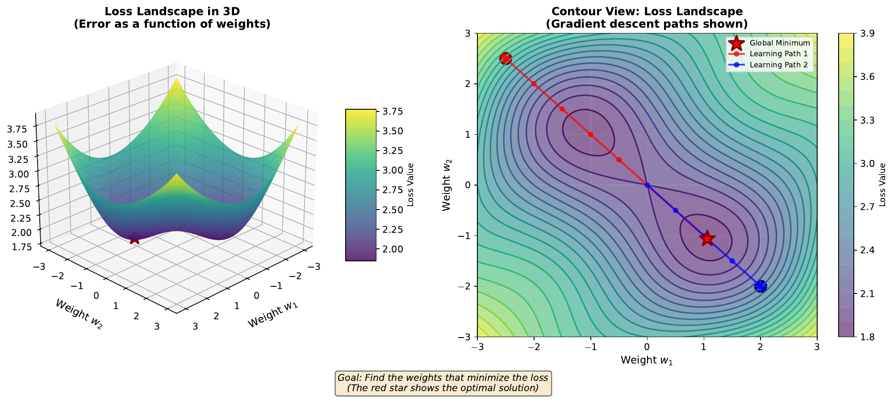

# Loss Landscape

---

## Learning Goal

Visualize the error surface that neural networks navigate during training.

---

## Key Concept

The **loss function** measures how wrong our predictions are. For each possible combination of weights, we can calculate the total error across all training examples. If we plot this error as a function of weights, we get the **loss landscape** - a surface with hills (high error) and valleys (low error).

Training a neural network is like finding the lowest point in this landscape. The **global minimum** is the lowest point overall - the best possible weights. Local minima are lower points surrounded by higher ground, but not the absolute lowest.

With only two weights, we can visualize this as a 3D surface. With millions of weights (typical for modern networks), the landscape exists in millions of dimensions - impossible to visualize but mathematically identical.

The shape of the loss landscape determines how easy or hard training will be. Smooth landscapes with few local minima are easier to optimize than rugged landscapes with many traps.

---

## Visual

---

## Key Formula

**Binary Cross-Entropy Loss** (for classification):

$$L = -\frac{1}{N}\sum_{i=1}^{N} [y_i \log(\hat{y}_i) + (1-y_i)\log(1-\hat{y}_i)]$$

Where:
- **N** = number of training examples
- **y_i** = true label (0 or 1)
- **y-hat_i** = predicted probability
- **L** = loss value (lower is better)

---

## Intuitive Explanation

Imagine you're blindfolded on a hilly terrain, trying to find the lowest valley. You can only feel the slope directly beneath your feet. The loss landscape is like this terrain, where:

- Your position = current weight values
- Altitude = prediction error (loss)
- Goal = find the lowest altitude (minimum loss)

The challenge: you might get stuck in a small dip (local minimum) without realizing there's a deeper valley nearby. Training strategies like momentum and learning rate schedules help escape such traps.

---

## Practice Problems

### Problem 1
Calculate the binary cross-entropy loss for a single prediction where the true label is y = 1 and the predicted probability is y-hat = 0.9.

Solution

$$L = -[y \log(\hat{y}) + (1-y)\log(1-\hat{y})]$$
$$L = -[1 \cdot \log(0.9) + (1-1) \cdot \log(1-0.9)]$$
$$L = -[\log(0.9) + 0]$$
$$L = -(-0.105) = 0.105$$

The loss is **0.105**. This is low because our prediction (90%) closely matches the true label (1).

### Problem 2
Now calculate the loss when y = 1 but y-hat = 0.1 (a bad prediction).

Solution

$$L = -[1 \cdot \log(0.1) + 0 \cdot \log(0.9)]$$
$$L = -[\log(0.1)]$$
$$L = -(-2.303) = 2.303$$

The loss is **2.303** - much higher than before! This penalizes confident wrong predictions severely.

Comparison:
- Good prediction (y-hat=0.9): Loss = 0.105
- Bad prediction (y-hat=0.1): Loss = 2.303 (22x worse)

### Problem 3
Why does cross-entropy loss use logarithms? What happens to the loss as the prediction approaches the wrong answer (y-hat -> 0 when y = 1)?

Solution

**Why logarithms:**

1. **Penalize confident mistakes severely**: log(0.01) = -4.6, log(0.001) = -6.9

2. **Mathematical convenience**: Connects to information theory and maximum likelihood

3. **Gradient properties**: Produces well-behaved gradients for training

**As y-hat -> 0 when y = 1:**
$$L = -\log(\hat{y}) \rightarrow -\log(0^+) = +\infty$$

The loss approaches infinity! This makes sense: if you're 100% confident the answer is 0 when it's actually 1, you deserve infinite penalty.

This is why sigmoid (bounded between 0 and 1, never exactly 0 or 1) is preferred over hard thresholding.

---

## Key Takeaways

- Loss functions quantify prediction error
- The loss landscape shows error as a function of weights
- Training seeks to find the minimum loss (optimal weights)
- Cross-entropy severely penalizes confident wrong predictions
- Landscape shape affects how easily we can find good solutions
