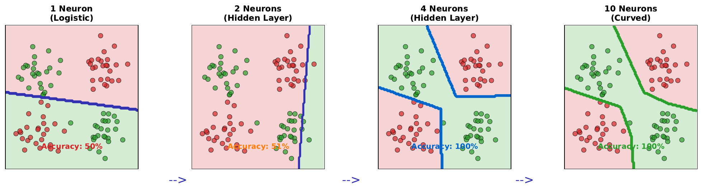

# Boundary Evolution

---

## Learning Goal

Observe how increasing the number of neurons improves decision boundaries.

---

## Key Concept

The **expressivity** of a neural network - its ability to represent complex functions - increases with more neurons. This manifests as more flexible decision boundaries.

- **1 neuron**: Can only create a straight line boundary. Fails on XOR-like patterns.
- **2-4 neurons**: Can create piecewise linear boundaries with some curvature
- **10+ neurons**: Can create smooth, curved boundaries that wrap around complex clusters

With enough neurons, a single hidden layer can theoretically approximate any continuous function (Universal Approximation Theorem). However, practical considerations (training time, overfitting) limit network size.

The key insight: **more neurons = more capacity to represent complex patterns**. But this capacity must be balanced against available training data to avoid overfitting.

---

## Visual



---

## Key Formula

**Network capacity (approximate):**

A single hidden layer with n neurons can represent boundaries with approximately n "bends" or segments.

**Universal Approximation Theorem** (informal):
A feedforward network with one hidden layer containing a finite number of neurons can approximate any continuous function to arbitrary accuracy, given sufficient neurons.

---

## Intuitive Explanation

Imagine drawing with different tools:
- **1 neuron**: A single ruler - can only draw straight lines
- **2 neurons**: Two rulers - can make an angle (V-shape)
- **4 neurons**: A flexible curve with several bends
- **10 neurons**: A smooth, complex curve that can wrap around clusters

Each neuron contributes one "bend" to the decision boundary. The more bends available, the more precisely the boundary can separate complex patterns.

---

## Practice Problems

### Problem 1
A dataset has an XOR pattern (like a checkerboard). What is the minimum number of hidden neurons needed to solve it with a single hidden layer?

<details><summary>Solution</summary>

**Minimum: 2 hidden neurons**

XOR requires separating diagonal corners. With 2 neurons:
- Neuron 1: Creates one linear boundary
- Neuron 2: Creates another linear boundary
- Combined: The intersection creates an XOR-compatible separation

With 1 neuron: Only one straight line = cannot solve XOR

Visualization:
```
Neuron 1: /       Neuron 2: \       Combined: X
```

The two boundaries intersect, creating four regions that match XOR's four quadrants.

</details>

### Problem 2
You have 500 training samples. Would you use 10 neurons or 500 neurons in the hidden layer? Why?

<details><summary>Solution</summary>

**Use 10 neurons**, not 500.

**Reasoning:**

With 500 neurons:
- Parameters (assuming 10 inputs): 10 x 500 + 500 + 500 x 1 + 1 = 6,001
- Parameters exceed training samples (6,001 > 500)
- High risk of **overfitting** - network can memorize each training point
- Poor generalization to new data

With 10 neurons:
- Parameters: 10 x 10 + 10 + 10 x 1 + 1 = 121
- Parameters much less than training samples (121 << 500)
- Forces network to find **generalizable patterns**
- Better expected test performance

**Rule of thumb**: Keep parameters well below training samples.

</details>

### Problem 3
As neurons increase from 1 to 10, training accuracy improves from 50% to 100%. Is this necessarily good?

<details><summary>Solution</summary>

**Not necessarily** - we need to check test accuracy.

**Scenarios:**

| Neurons | Train Acc | Test Acc | Assessment |
|---------|-----------|----------|------------|
| 1 | 50% | 52% | Underfitting (too simple) |
| 4 | 75% | 72% | Good generalization |
| 10 | 100% | 70% | Possible overfitting |

If 10 neurons achieves 100% training accuracy but test accuracy is lower than simpler models, we have **overfitting**.

**Signs of overfitting:**
- Training accuracy >> test accuracy
- Perfect training accuracy (memorization)
- Adding neurons improves training but hurts test

**Solution**: Choose the model with best test accuracy (likely 4-6 neurons in this example), use regularization, or get more data.

</details>

---

## Key Takeaways

- More neurons = more flexible decision boundaries
- 1 neuron creates linear boundary; many neurons create curved boundaries
- Universal Approximation: enough neurons can fit any pattern
- But more neurons also increases overfitting risk
- Balance capacity with available data
