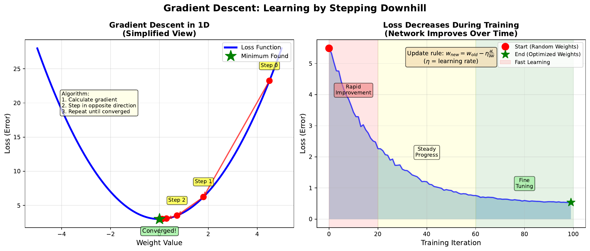

# Gradient Descent

[Back to Home](../index.html)

---

## Learning Goal

Understand how neural networks learn by iteratively adjusting weights to reduce error.

---

## Key Concept

**Gradient descent** is the algorithm that trains neural networks. The core idea is simple: calculate which direction reduces the error, then take a small step in that direction. Repeat until you reach a minimum.

The **gradient** tells us the slope of the loss landscape at our current position. It points "uphill" toward higher error. By stepping in the opposite direction (downhill), we reduce the loss.

The **learning rate** controls how big each step is. Too large, and we might overshoot the minimum. Too small, and training takes forever. Finding the right learning rate is crucial for effective training.

Each update follows:
$$w_{new} = w_{old} - \eta \cdot \frac{\partial L}{\partial w}$$

This simple rule, applied to all weights simultaneously, enables networks to learn complex patterns from data.

---

## Visual

---

## Key Formula

**Weight update rule:**
$$w := w - \eta \cdot \nabla_w L$$

Expanded for a single weight:
$$w_{new} = w_{old} - \eta \cdot \frac{\partial L}{\partial w}$$

Where:
- **w** = weight value
- **eta** = learning rate (typically 0.001 to 0.1)
- **dL/dw** = gradient (partial derivative of loss with respect to weight)
- **:=** means "update to"

---

## Intuitive Explanation

Imagine rolling a ball down a hill to find the lowest point:

1. **Calculate slope**: Which way is downhill? (gradient)
2. **Take a step**: Move in that direction (weight update)
3. **Repeat**: Keep going until you stop descending (convergence)

The learning rate is like the ball's momentum:
- **Too high**: Ball bounces over valleys, never settling
- **Too low**: Ball creeps slowly, taking ages to reach bottom
- **Just right**: Ball rolls smoothly into the lowest valley

---

## Practice Problems

### Problem 1
Current weight w = 2.5, learning rate eta = 0.1, gradient dL/dw = 0.8. Calculate the new weight after one update.

Solution

$$w_{new} = w_{old} - \eta \cdot \frac{\partial L}{\partial w}$$
$$w_{new} = 2.5 - 0.1 \cdot 0.8$$
$$w_{new} = 2.5 - 0.08 = 2.42$$

The weight decreased from 2.5 to **2.42**. The positive gradient meant we were on an uphill slope (with respect to w), so we moved w downward.

### Problem 2
After many iterations, the gradient becomes very small (dL/dw = 0.001). What does this indicate about the training?

Solution

A very small gradient indicates:

1. **Near a minimum**: The loss landscape is nearly flat, suggesting we're close to a minimum (either local or global)

2. **Convergence**: The weights are stabilizing; further updates will be tiny

3. **Possible plateau**: The network may have reached its best performance given the architecture and data

4. **Training completion**: This is often used as a stopping criterion

With eta = 0.1 and gradient = 0.001:
$$\Delta w = 0.1 \times 0.001 = 0.0001$$

Each update changes weights by only 0.01% - training is essentially complete.

### Problem 3
A colleague runs training with learning rate 10.0 and notices the loss is increasing each epoch. What went wrong?

Solution

The learning rate is **too high**, causing:

1. **Overshooting**: Each step is so large it jumps past the minimum

2. **Divergence**: Instead of descending, the ball bounces to higher points

3. **Increasing loss**: Error gets worse, not better

Example with w=2.5, gradient=0.8, eta=10.0:
$$w_{new} = 2.5 - 10.0 \times 0.8 = 2.5 - 8.0 = -5.5$$

That's a massive jump from 2.5 to -5.5! Such violent oscillations prevent convergence.

**Fix**: Reduce learning rate to 0.1 or 0.01.

---

## Key Takeaways

- Gradient descent iteratively reduces loss by following downhill direction
- Learning rate controls step size - crucial hyperparameter
- Too high = divergence, too low = slow convergence
- Small gradients indicate convergence (near minimum)
- This is the "learning" in machine learning

**Next Topic:** [09. Market Prediction Data](09-market-prediction-data.html) - Applying networks to real financial data
