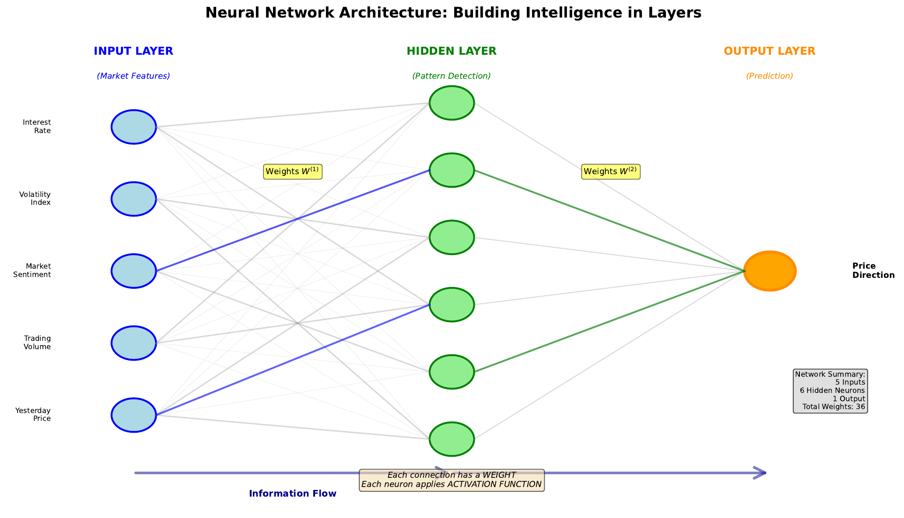

# Network Architecture

---

## Learning Goal

Design and understand the structure of a multi-layer neural network.

---

## Key Concept

A neural network is organized into **layers** of neurons. The **input layer** receives raw features (like price, volume, sentiment). **Hidden layers** transform these features into increasingly abstract representations. The **output layer** produces the final prediction.

Each connection between neurons has a **weight**, and each neuron (except inputs) has a **bias**. The total number of parameters (weights + biases) determines the network's capacity to learn complex patterns.

For a network predicting stock direction with 5 input features, 6 hidden neurons, and 1 output neuron:
- Input to hidden: 5 x 6 = 30 weights + 6 biases = 36 parameters
- Hidden to output: 6 x 1 = 6 weights + 1 bias = 7 parameters
- **Total: 43 learnable parameters**

The architecture choices (number of layers, neurons per layer) are **hyperparameters** that we set before training. Too few neurons = underfitting. Too many = overfitting or slow training.

---

## Visual

---

## Key Formula

**Parameter counting for a fully connected layer:**

$$\text{Parameters} = (\text{inputs} \times \text{outputs}) + \text{outputs}$$

Where:
- inputs x outputs = number of weights
- outputs = number of biases (one per neuron)

**For multiple layers:**
$$\text{Total} = \sum_{\text{layer } l} (n_{l-1} \times n_l + n_l)$$

---

## Intuitive Explanation

Think of a neural network as a factory assembly line:

- **Input layer**: Raw materials arrive (stock price, volume, etc.)
- **Hidden layer 1**: Workers detect simple patterns (is price rising? is volume high?)
- **Hidden layer 2**: Supervisors combine simple patterns (rising price + high volume = momentum)
- **Output layer**: Manager makes final decision (BUY or SELL)

Each worker (neuron) has different skills (weights) for evaluating the incoming information. During training, workers learn which signals matter most for making good predictions.

---

## Practice Problems

### Problem 1
A network has architecture [10, 8, 6, 1]. How many total parameters does it have?

Solution

Layer by layer:
- Input (10) to Hidden1 (8): 10 x 8 + 8 = 80 + 8 = 88
- Hidden1 (8) to Hidden2 (6): 8 x 6 + 6 = 48 + 6 = 54
- Hidden2 (6) to Output (1): 6 x 1 + 1 = 6 + 1 = 7

**Total: 88 + 54 + 7 = 149 parameters**

### Problem 2
You have 1,000 training samples. A colleague suggests a network with architecture [50, 100, 100, 50, 1]. Calculate the number of parameters. Is this a good idea?

Solution

Parameter count:
- 50 to 100: 50 x 100 + 100 = 5,100
- 100 to 100: 100 x 100 + 100 = 10,100
- 100 to 50: 100 x 50 + 50 = 5,050
- 50 to 1: 50 x 1 + 1 = 51

**Total: 20,301 parameters**

With only 1,000 training samples and 20,301 parameters, the network has **20x more parameters than data points**. This will almost certainly overfit - the network will memorize training data rather than learn generalizable patterns.

**Recommendation:** Use a much smaller network, like [50, 20, 1] with 1,041 parameters, or get more training data.

### Problem 3
Why do we call the middle layers "hidden"?

Solution

The middle layers are called "hidden" because:

1. **Not directly observable**: Unlike inputs (which we provide) and outputs (which we measure), hidden layer values are internal to the network

2. **Abstract representations**: They encode patterns that may not have obvious real-world interpretations

3. **Emergent features**: The network learns what to compute in hidden layers - we don't specify it directly

4. **Historical naming**: Early neural network diagrams showed inputs and outputs as visible, with intermediate layers hidden from direct observation

The hidden layers are where the "magic" happens - where raw features transform into useful representations for prediction.

---

## Key Takeaways

- Networks have input, hidden, and output layers
- Each connection has a weight; each neuron has a bias
- More neurons = more capacity, but also risk of overfitting
- Architecture is a hyperparameter chosen before training
- Rule of thumb: parameters should be less than training samples
