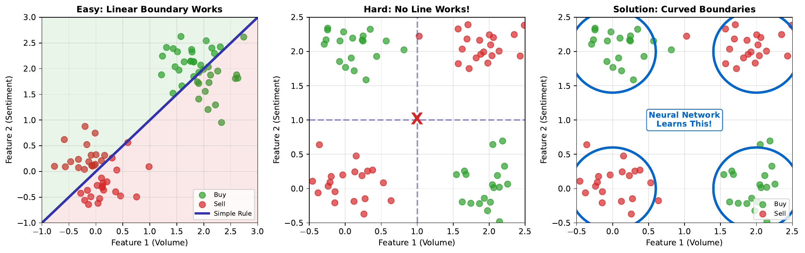

# Decision Boundary Concept

---

## Learning Goal

Understand the difference between linear and curved decision boundaries.

---

## Key Concept

A **decision boundary** is the surface in feature space where the classifier's prediction changes from one class to another. On one side, the model predicts "UP"; on the other side, "DOWN."

**Linear boundaries** are straight lines (in 2D) or flat planes (in higher dimensions). A single neuron creates a linear boundary. These work well when classes are cleanly separated by a straight line.

**Curved boundaries** bend and flex through feature space. Multiple neurons in hidden layers create curved boundaries by combining multiple linear boundaries. These are essential for non-linearly separable problems like XOR.

The goal of training is to position the decision boundary where it best separates the classes. More flexible boundaries (from deeper networks) can fit more complex patterns but risk overfitting.

---

## Visual

---

## Key Formula

**Linear boundary equation:**
$$w_1 x_1 + w_2 x_2 + b = 0$$

This is a line in 2D space. Points satisfying this equation lie exactly on the boundary.

**Neural network boundary:**
With hidden layers, the effective boundary becomes a composition of functions, creating curves that cannot be expressed as a single linear equation.

---

## Intuitive Explanation

Imagine dividing a park into "dog zone" and "cat zone":

- **Linear boundary**: A straight fence across the park. Easy to build, but dogs and cats might not naturally separate along a straight line.

- **Curved boundary**: A winding fence that follows the natural clusters where each species gathers. More complex to build, but better separation.

Neural networks learn to build curved fences (decision boundaries) that wrap around the natural clusters in data.

---

## Practice Problems

### Problem 1
A linear decision boundary is defined by: 2x1 - 3x2 + 1 = 0. Classify the point (2, 1).

Solution

Substitute into the equation:
$$2(2) - 3(1) + 1 = 4 - 3 + 1 = 2$$

Since 2 > 0, the point (2, 1) is on the **positive side** of the boundary.

If positive = "UP" class:
The model predicts **UP** for this point.

### Problem 2
The same boundary: 2x1 - 3x2 + 1 = 0. Find a point that lies exactly on the boundary.

Solution

We need 2x1 - 3x2 + 1 = 0.

Let x2 = 1:
$$2x_1 - 3(1) + 1 = 0$$
$$2x_1 - 2 = 0$$
$$x_1 = 1$$

The point **(1, 1)** lies exactly on the boundary.

Verification: 2(1) - 3(1) + 1 = 2 - 3 + 1 = 0 [checkmark]

At this point, the model is maximally uncertain - 50% confidence in either class.

### Problem 3
Why does a deeper network (more hidden layers) create more complex decision boundaries?

Solution

Each layer adds transformations that bend the boundary:

**Layer 1**: Creates several linear boundaries

**Layer 2**: Combines these into piecewise linear curves

**Layer 3+**: Combines curves into increasingly smooth and complex shapes

Mathematically:
- One hidden layer: Can approximate any continuous function (universal approximation theorem), but may need many neurons
- More layers: Can approximate the same complexity with fewer total neurons
- Each layer adds "bending capacity" to the boundary

**Trade-offs:**
- More complex boundaries fit training data better
- Too complex = overfitting (memorizing noise)
- Just right = generalizable patterns captured

---

## Key Takeaways

- Decision boundaries separate classes in feature space
- Linear boundaries: straight lines, created by single neurons
- Curved boundaries: flexible shapes, require hidden layers
- More layers = more complex boundaries possible
- Balance complexity: enough to capture patterns, not so much as to overfit
