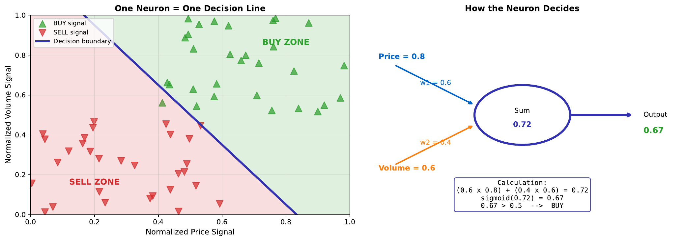

# Neuron Decision Maker

[Back to Home](../index.html)

---

## Learning Goal

See how a single neuron makes buy/sell decisions using a threshold.

---

## Key Concept

A single neuron acts as a **decision maker** by comparing its output to a **threshold**. For binary classification with sigmoid activation:
- Output > 0.5: Predict Class 1 (BUY)
- Output <= 0.5: Predict Class 0 (SELL)

The neuron computes a weighted combination of inputs, transforms it through the sigmoid function, and produces a probability. The threshold converts this probability into a discrete decision.

In trading terms: if the neuron outputs 0.67 (67% confidence in price increase), the decision is BUY. If it outputs 0.33 (33% confidence), the decision is SELL.

The position of the decision boundary in feature space corresponds to where the neuron output equals exactly 0.5 - the point of maximum uncertainty.

---

## Visual

---

## Key Formula

**Neuron computation:**
$$z = w_1 x_1 + w_2 x_2 + b$$
$$\hat{y} = \sigma(z) = \frac{1}{1 + e^{-z}}$$

**Decision rule:**
$$\text{Decision} = \begin{cases} \text{BUY} & \text{if } \hat{y} > 0.5 \\ \text{SELL} & \text{if } \hat{y} \leq 0.5 \end{cases}$$

**Boundary condition (y-hat = 0.5):**
$$z = 0 \implies w_1 x_1 + w_2 x_2 + b = 0$$

---

## Intuitive Explanation

Think of the neuron as a judge weighing evidence:

1. **Gather evidence**: Each input (price, volume) provides information
2. **Weight importance**: Some evidence matters more (larger weights)
3. **Combine and evaluate**: Sum weighted evidence, adjust by bias
4. **Confidence level**: Sigmoid converts to 0-100% confidence
5. **Make decision**: If confidence > 50%, rule in favor (BUY)

The weights encode what the neuron has learned about which inputs matter and how much.

---

## Practice Problems

### Problem 1
A neuron has weights w1 = 0.6 (for price), w2 = 0.4 (for volume), and bias b = -0.3. Given price = 0.8 and volume = 0.5, what is the decision?

Solution

**Step 1: Weighted sum**
$$z = 0.6(0.8) + 0.4(0.5) + (-0.3)$$
$$z = 0.48 + 0.20 - 0.30 = 0.38$$

**Step 2: Sigmoid activation**
$$\hat{y} = \frac{1}{1 + e^{-0.38}} = \frac{1}{1 + 0.684} = 0.594$$

**Step 3: Decision**
Since 0.594 > 0.5:
**Decision: BUY** (59.4% confidence in price increase)

### Problem 2
Using the same neuron, what values of (price, volume) lie exactly on the decision boundary?

Solution

On the boundary, z = 0:
$$0.6 \cdot \text{price} + 0.4 \cdot \text{volume} - 0.3 = 0$$

Solving for volume:
$$\text{volume} = \frac{0.3 - 0.6 \cdot \text{price}}{0.4}$$
$$\text{volume} = 0.75 - 1.5 \cdot \text{price}$$

Example points on the boundary:
- price = 0.0: volume = 0.75
- price = 0.5: volume = 0.0
- price = 0.3: volume = 0.3

These points all yield 50% confidence (maximum uncertainty).

### Problem 3
If we change the threshold from 0.5 to 0.7, how does this affect trading behavior?

Solution

**With threshold = 0.7:**
- BUY only if y-hat > 0.7 (70% confidence required)
- More conservative - fewer buy signals
- Reduces false positives (buying when shouldn't)
- May miss some true opportunities (false negatives)

**Trade-offs:**

| Threshold | BUY signals | False positives | Missed opportunities |
|-----------|-------------|-----------------|---------------------|
| 0.5 | Many | More | Fewer |
| 0.7 | Fewer | Fewer | More |
| 0.9 | Very few | Very few | Many |

**In practice:**
- Aggressive traders: lower threshold (0.5-0.6)
- Conservative traders: higher threshold (0.7-0.8)
- Threshold choice depends on asymmetric costs of errors

---

## Key Takeaways

- A neuron outputs a probability via sigmoid activation
- Default threshold of 0.5 converts probability to binary decision
- The decision boundary is where output = 0.5 (z = 0)
- Threshold can be adjusted based on risk tolerance
- Single neuron = single linear decision boundary

**Next Topic:** [14. Sigmoid Saturation](14-sigmoid-saturation.html) - When activation functions cause problems
