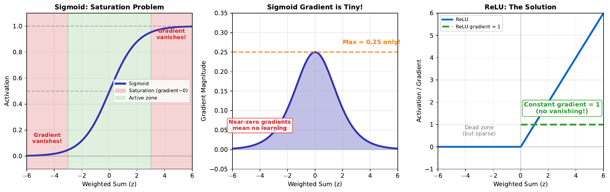

# Sigmoid Saturation

---

## Learning Goal

Understand the vanishing gradient problem caused by sigmoid saturation.

---

## Key Concept

The sigmoid function **saturates** at extreme values. When z is very large (e.g., z > 3) or very small (z < -3), the sigmoid output is nearly 1 or 0, and barely changes regardless of input changes.

This creates the **vanishing gradient problem**. During backpropagation, gradients flow backward through the network. In saturated regions, gradients become extremely small (near zero), so weights barely update. The network stops learning.

The **maximum gradient** of sigmoid is only 0.25 (at z = 0). In deep networks, multiplying many small gradients results in effectively zero gradient for early layers - they learn very slowly or not at all.

**ReLU** solves this by having a constant gradient of 1 for positive inputs. However, ReLU has its own issue: neurons can "die" if z is always negative (gradient = 0).

---

## Visual

---

## Key Formula

**Sigmoid and its derivative:**
$$\sigma(z) = \frac{1}{1 + e^{-z}}$$

$$\sigma'(z) = \sigma(z)(1 - \sigma(z))$$

**Maximum derivative:**
$$\max(\sigma'(z)) = \sigma(0)(1 - \sigma(0)) = 0.5 \times 0.5 = 0.25$$

**ReLU and its derivative:**
$$\text{ReLU}(z) = \max(0, z)$$

$$\text{ReLU}'(z) = \begin{cases} 1 & z > 0 \\ 0 & z \leq 0 \end{cases}$$

---

## Intuitive Explanation

Imagine pushing a ball on different surfaces:
- **Sigmoid at extremes**: Like pushing a ball on a flat plateau. No matter how hard you push, it barely moves. (Small gradient = little learning)
- **Sigmoid at center**: Gentle slope, ball rolls smoothly. (Gradient = 0.25)
- **ReLU positive region**: Constant slope, ball rolls consistently. (Gradient = 1)
- **ReLU negative region**: Another flat plateau, ball doesn't move.

For efficient learning, we want consistent, non-vanishing gradients throughout.

---

## Practice Problems

### Problem 1
Calculate the sigmoid derivative at z = 5. How does it compare to the maximum derivative?

Solution

First, calculate sigmoid:
$$\sigma(5) = \frac{1}{1 + e^{-5}} = \frac{1}{1 + 0.0067} = 0.9933$$

Then, calculate derivative:
$$\sigma'(5) = \sigma(5)(1 - \sigma(5)) = 0.9933 \times 0.0067 = 0.0067$$

**Comparison to maximum:**
$$\frac{0.0067}{0.25} = 0.027 = 2.7\%$$

At z = 5, the gradient is only **2.7% of maximum**. Learning is extremely slow in this saturated region.

### Problem 2
A network has 5 layers, each with sigmoid activation. If each layer's gradient is 0.2, what is the total gradient that reaches the first layer?

Solution

Gradients multiply through layers (chain rule):
$$\text{Total gradient} = 0.2 \times 0.2 \times 0.2 \times 0.2 \times 0.2 = 0.2^5$$
$$= 0.00032$$

The first layer receives a gradient of only **0.00032** - practically zero!

With learning rate 0.1:
$$\Delta w = 0.1 \times 0.00032 = 0.000032$$

Weight updates are negligible. The first layer cannot learn effectively.

**This is the vanishing gradient problem.**

### Problem 3
Why did ReLU become the default activation for hidden layers in modern networks?

Solution

**ReLU advantages over sigmoid:**

1. **No saturation for positive values**: Gradient = 1 always (no vanishing)

2. **Computational efficiency**: max(0, z) is faster than exponentials

3. **Sparse activation**: Neurons with z < 0 output exactly 0, creating sparse representations

4. **Biological plausibility**: More similar to actual neuron firing rates

5. **Faster convergence**: Networks train significantly faster

**ReLU disadvantage:**
- "Dying ReLU" - if z always < 0, neuron is permanently dead
- Solved by variants: Leaky ReLU, ELU, GELU

**When to still use sigmoid:**
- Output layer for binary classification (need 0-1 probability)
- Gating mechanisms (LSTM, attention)

---

## Key Takeaways

- Sigmoid saturates at extreme values (gradient near 0)
- Maximum sigmoid gradient is only 0.25
- Vanishing gradients prevent learning in deep networks
- ReLU has constant gradient = 1 for positive inputs
- Modern networks use ReLU (or variants) for hidden layers
