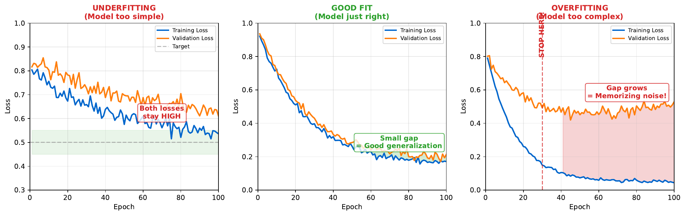

# Overfitting vs Underfitting

---

## Learning Goal

Diagnose and prevent common training problems using learning curves.

---

## Key Concept

**Underfitting** occurs when a model is too simple to capture patterns in the data. Both training and test error remain high. The solution: increase model complexity.

**Overfitting** occurs when a model is too complex, memorizing training data rather than learning generalizable patterns. Training error is low but test error is high. The solution: reduce complexity, get more data, or use regularization.

The **ideal model** captures genuine patterns without memorizing noise. Both training and test error converge to similarly low values.

**Learning curves** plot training and validation loss over training epochs. The shape reveals the problem:
- Both high, not improving: Underfitting
- Training drops, validation rises: Overfitting
- Both converge to similar low values: Good fit

---

## Visual



---

## Key Formula

**Bias-Variance Tradeoff:**

$$\text{Total Error} = \text{Bias}^2 + \text{Variance} + \text{Irreducible Noise}$$

- **High bias (underfitting)**: Model too simple, misses patterns
- **High variance (overfitting)**: Model too sensitive to training data
- **Goal**: Minimize both bias and variance

---

## Intuitive Explanation

Imagine memorizing vs understanding:

- **Underfitting**: A student who barely studies. They don't understand the material and fail both homework and exams.

- **Overfitting**: A student who memorizes answers verbatim. They ace homework but fail exams with new questions they've never seen.

- **Good fit**: A student who understands the concepts. They perform well on both homework and exams because they've learned generalizable knowledge.

The goal is understanding (generalization), not memorization.

---

## Practice Problems

### Problem 1
Training loss = 0.15, Validation loss = 0.65. What is the diagnosis, and what should you try?

<details><summary>Solution</summary>

**Diagnosis: Overfitting**

Evidence:
- Training loss is low (0.15) - model fits training data well
- Validation loss is high (0.65) - model fails on new data
- Gap: 0.65 - 0.15 = 0.50 (large gap indicates overfitting)

**Solutions to try:**

1. **More data**: If possible, collect more training examples

2. **Regularization**: Add L2 (weight decay) or dropout

3. **Simpler model**: Fewer layers or neurons

4. **Early stopping**: Stop training when validation loss starts rising

5. **Data augmentation**: Create variations of existing data

6. **Cross-validation**: Ensure result isn't due to unlucky train/validation split

</details>

### Problem 2
Training loss = 0.55, Validation loss = 0.58. What is the diagnosis, and what should you try?

<details><summary>Solution</summary>

**Diagnosis: Underfitting**

Evidence:
- Training loss is high (0.55) - model doesn't fit training data well
- Validation loss is similar (0.58)
- Small gap (0.03) but both values are high

**Solutions to try:**

1. **More complex model**: Add layers or neurons

2. **Train longer**: More epochs might help

3. **Better features**: Engineer more informative inputs

4. **Reduce regularization**: If using dropout/L2, reduce it

5. **Lower learning rate**: Current rate might be preventing convergence

6. **Check data quality**: Ensure labels are correct and features are meaningful

</details>

### Problem 3
Explain why early stopping prevents overfitting.

<details><summary>Solution</summary>

**Early stopping mechanism:**

During training:
1. Initially, both training and validation loss decrease
2. At some point, validation loss stops decreasing (or starts increasing)
3. Training loss may continue to decrease (memorization begins)
4. Early stopping halts training at the "sweet spot"

**Why it works:**

- **Before sweet spot**: Model is learning useful patterns
- **After sweet spot**: Model is memorizing training noise
- **Early stopping**: Captures useful patterns, avoids memorization

**Implementation:**
```
best_val_loss = infinity
patience = 10  # epochs without improvement
counter = 0

for each epoch:
    train()
    val_loss = validate()
    if val_loss < best_val_loss:
        best_val_loss = val_loss
        save_model()
        counter = 0
    else:
        counter += 1
        if counter >= patience:
            stop_training()
            load_best_model()
```

This automatically selects the model with best generalization.

</details>

---

## Key Takeaways

- Underfitting: Model too simple, high train and test error
- Overfitting: Model memorizes, low train error but high test error
- Learning curves diagnose the problem visually
- Solutions: Adjust complexity, regularization, data, early stopping
- Goal: Low error on both training and test sets
