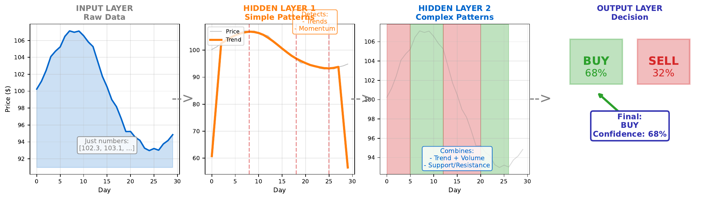

# Feature Hierarchy

[Back to Home](../index.html)

---

## Learning Goal

Understand how different layers learn increasingly abstract representations.

---

## Key Concept

Neural networks learn **hierarchical representations**. Each layer transforms the data into a more abstract form:

- **Input layer**: Raw features (price, volume, sentiment)
- **Hidden layer 1**: Simple patterns (uptrend, high volume, positive sentiment)
- **Hidden layer 2**: Combinations (momentum + volume spike = strong signal)
- **Output layer**: Final decision (BUY/SELL with confidence)

This hierarchy emerges automatically through training. The network learns what intermediate representations are useful for the final task. Early layers detect simple patterns; later layers combine these into complex concepts.

In image recognition, this is visible: early layers detect edges, middle layers detect shapes, late layers detect objects. For financial data, the learned features are less visually interpretable but follow the same principle.

---

## Visual

---

## Key Formula

**Layer-by-layer transformation:**

$$h^{[1]} = f(W^{[1]} x + b^{[1]}) \quad \text{(simple patterns)}$$

$$h^{[2]} = f(W^{[2]} h^{[1]} + b^{[2]}) \quad \text{(complex patterns)}$$

$$\hat{y} = \sigma(W^{[3]} h^{[2]} + b^{[3]}) \quad \text{(decision)}$$

Each layer builds on the representations from the previous layer.

---

## Intuitive Explanation

Think of a corporate decision-making process:

1. **Analysts (Input)**: Collect raw data - stock prices, trading volumes
2. **Junior managers (Hidden 1)**: Identify simple patterns - "prices rising," "unusual volume"
3. **Senior managers (Hidden 2)**: Combine patterns - "rising prices + high volume = momentum"
4. **Executive (Output)**: Make final call - "Confidence: 68% BUY"

Each level adds interpretation and abstraction. The executive doesn't need raw numbers - they need the synthesized judgment of their team.

---

## Practice Problems

### Problem 1
A network for fraud detection has 3 hidden layers. What might each layer learn?

Solution

**Layer 1 - Simple anomalies:**
- Transaction amount unusually high
- Time of transaction (late night)
- Location different from usual
- Transaction frequency spike

**Layer 2 - Pattern combinations:**
- High amount + unusual time = suspicious
- New location + high frequency = potential card theft
- Normal amount + normal patterns = likely legitimate

**Layer 3 - Complex fraud signatures:**
- Combination of multiple suspicious patterns
- Sequential transaction patterns (testing then big purchase)
- Network of related suspicious accounts

**Output - Fraud score:**
- Probability of fraud (0-100%)
- Decision threshold (e.g., flag if > 80%)

Each layer abstracts further from raw data toward the final fraud determination.

### Problem 2
Why can't we interpret what middle layer neurons have learned as easily as input features?

Solution

**Reasons for difficulty:**

1. **Distributed representations**: Information is spread across many neurons, not localized in one

2. **Non-linear combinations**: Each neuron combines inputs in complex, non-intuitive ways

3. **No predefined meaning**: Unlike "price" or "volume," hidden neurons learn their own abstract concepts

4. **Redundancy**: Multiple neurons may capture similar patterns in different ways

5. **Task-specific**: What neurons learn depends on the specific prediction task

**Example:**
Hidden neuron output might be: 0.73

What does 0.73 mean? It's a combination of multiple inputs, transformed non-linearly. It represents "something useful for prediction" but not a human-interpretable concept.

**Research area**: "Interpretability" or "Explainable AI" tries to understand these learned representations.

### Problem 3
Does adding more layers always improve performance?

Solution

**No** - more layers is not always better.

**Potential benefits:**
- Deeper hierarchies can represent more complex patterns
- Each layer can specialize in different abstraction levels
- Sometimes necessary for very complex tasks

**Potential problems:**

1. **Vanishing gradients**: Deep networks may not train well (especially with sigmoid)

2. **Overfitting**: More layers = more parameters = higher overfit risk

3. **Diminishing returns**: Simple problems don't need deep hierarchies

4. **Computational cost**: Training time increases significantly

5. **Degradation problem**: Very deep networks can perform worse than shallow ones (solved by residual connections)

**Guidelines:**
- Start simple (1-2 hidden layers)
- Add depth only if needed
- Use modern architectures (ResNets) for very deep networks
- Match depth to problem complexity

---

## Key Takeaways

- Networks learn hierarchical representations automatically
- Early layers: simple patterns; Later layers: complex combinations
- Deeper networks can represent more abstract concepts
- Hidden representations are often not human-interpretable
- More layers isn't always better - match complexity to problem

**Next Topic:** [17. Overfitting vs Underfitting](17-overfitting-underfitting.html) - When learning goes wrong
