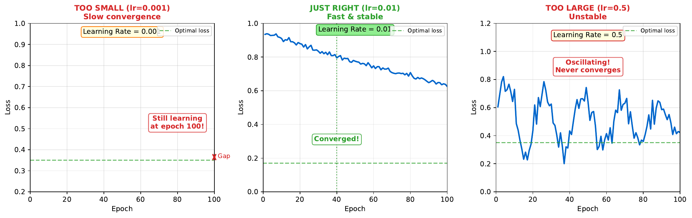

# Learning Rate Comparison

---

## Learning Goal

Understand how learning rate affects training speed and stability.

---

## Key Concept

The **learning rate** controls how big a step we take during gradient descent. It's one of the most important hyperparameters in neural network training.

**Too small** (e.g., 0.0001): Training is stable but extremely slow. The network may never reach a good solution in reasonable time.

**Too large** (e.g., 1.0): Training is unstable. The loss may oscillate wildly or even diverge to infinity. The network overshoots the minimum.

**Just right** (typically 0.001-0.01): Steady progress toward minimum. Fast enough to converge in reasonable time, stable enough not to diverge.

Finding the optimal learning rate often requires experimentation. Techniques like **learning rate schedules** (reducing rate over time) and **adaptive methods** (Adam, RMSprop) help automate this process.

---

## Visual

---

## Key Formula

**Weight update:**
$$w := w - \eta \cdot \nabla L$$

**Effect of learning rate:**
- Small eta: $\Delta w$ is small, slow movement
- Large eta: $\Delta w$ is large, fast but potentially unstable movement

**Common learning rate schedules:**

Step decay:
$$\eta_t = \eta_0 \times \gamma^{\lfloor t/k \rfloor}$$

Exponential decay:
$$\eta_t = \eta_0 \times e^{-\lambda t}$$

---

## Intuitive Explanation

Imagine walking downhill with a blindfold:

- **Too small step**: You inch forward, taking forever to reach the bottom
- **Too large step**: You leap so far you might land on the opposite hill
- **Just right**: Steady steps that make good progress without losing balance

The terrain (loss landscape) determines what "just right" means. Steeper hills allow smaller steps; flat areas can use larger steps.

---

## Practice Problems

### Problem 1
You train with learning rate 0.1 and observe: Loss at epoch 1 = 0.8, epoch 2 = 0.5, epoch 3 = 0.4, epoch 4 = 0.38, epoch 5 = 0.37. What pattern do you see?

Solution

**Pattern: Diminishing returns (normal convergence)**

Analysis:
- Epoch 1->2: Improvement of 0.3 (37.5% reduction)
- Epoch 2->3: Improvement of 0.1 (20% reduction)
- Epoch 3->4: Improvement of 0.02 (5% reduction)
- Epoch 4->5: Improvement of 0.01 (2.6% reduction)

This is **healthy training behavior**:
- Rapid early progress (large gradients far from minimum)
- Slowing improvement (smaller gradients near minimum)
- Convergence to stable value

The learning rate (0.1) appears appropriate for this problem.

### Problem 2
You train with learning rate 1.0 and observe: Loss at epoch 1 = 0.8, epoch 2 = 1.5, epoch 3 = 3.2, epoch 4 = 8.7, epoch 5 = NaN. What happened?

Solution

**Diagnosis: Learning rate too high - divergence**

What happened:
- Epoch 1->2: Loss increased (0.8 -> 1.5) - overshot minimum
- Epoch 2->3: Continued increasing - oscillating past optimal
- Epoch 3->4: Accelerating growth - unstable regime
- Epoch 5: NaN (Not a Number) - loss exploded to infinity

**Why:**
- Large eta means large weight updates
- Updates so large they jump past the minimum to higher loss regions
- Positive feedback: higher loss -> larger gradient -> even larger update
- Eventually overflows numerical precision (NaN)

**Fix:** Reduce learning rate significantly (try 0.01 or 0.001)

### Problem 3
Describe how the Adam optimizer adjusts learning rate automatically.

Solution

**Adam (Adaptive Moment Estimation):**

Adam adapts learning rate per-parameter based on:

1. **First moment (momentum)**: Running average of gradients
$$m_t = \beta_1 m_{t-1} + (1-\beta_1) g_t$$

2. **Second moment**: Running average of squared gradients
$$v_t = \beta_2 v_{t-1} + (1-\beta_2) g_t^2$$

3. **Bias correction**:
$$\hat{m}_t = m_t / (1-\beta_1^t)$$
$$\hat{v}_t = v_t / (1-\beta_2^t)$$

4. **Update**:
$$w_t = w_{t-1} - \eta \cdot \frac{\hat{m}_t}{\sqrt{\hat{v}_t} + \epsilon}$$

**Effect:**
- Parameters with large gradients get smaller effective learning rate
- Parameters with small gradients get larger effective learning rate
- Momentum smooths out noisy gradients

**Typical defaults:** eta=0.001, beta1=0.9, beta2=0.999

This reduces manual tuning compared to vanilla gradient descent.

---

## Key Takeaways

- Learning rate is critical: too small = slow, too large = unstable
- Look for diminishing returns pattern = healthy training
- Look for increasing loss = learning rate too high
- Learning rate schedules reduce rate over time
- Adaptive optimizers (Adam) adjust rate automatically
