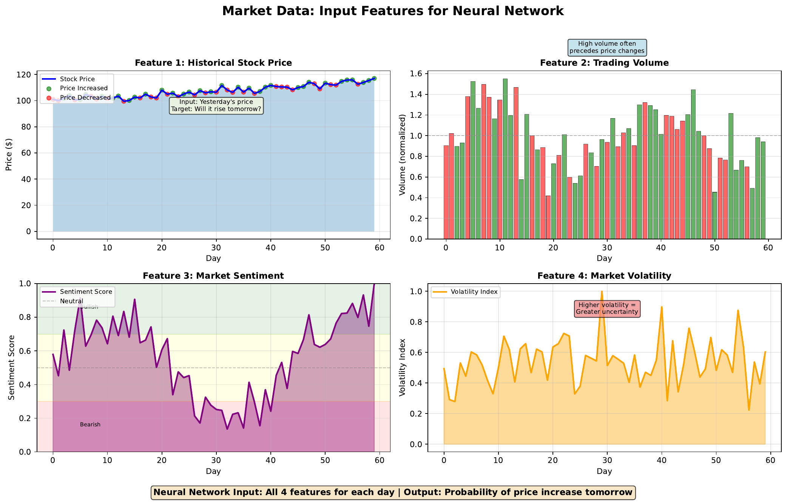

# Market Prediction Data

---

## Learning Goal

Understand how to prepare financial features for neural network input.

---

## Key Concept

Before training a neural network, we must convert raw market data into numerical features the network can process. This **feature engineering** step is crucial - the network can only learn patterns present in the features we provide.

For stock prediction, common features include:
- **Price data**: Returns, moving averages, momentum
- **Volume**: Trading activity, normalized by average
- **Sentiment**: News sentiment scores, social media signals
- **Volatility**: Price variability, option-implied volatility

Each feature should be **normalized** (scaled to similar ranges) so no single feature dominates due to scale differences. For example, stock prices might be hundreds of dollars while sentiment scores are between 0 and 1.

The **target variable** is what we're predicting - in binary classification, this might be 1 (price went up) or 0 (price went down).

---

## Visual

---

## Key Formula

**Normalization (Min-Max Scaling):**
$$x_{norm} = \frac{x - x_{min}}{x_{max} - x_{min}}$$

**Normalization (Z-score):**
$$x_{norm} = \frac{x - \mu}{\sigma}$$

Where:
- **x** = original value
- **x_min, x_max** = minimum and maximum in dataset
- **mu** = mean
- **sigma** = standard deviation

---

## Intuitive Explanation

Think of feature engineering as translation. Raw market data speaks in different "languages" (dollars, shares, percentages). The neural network needs all inputs in the same "language" (normalized numbers near 0).

Without normalization:
- Price: 150.00
- Volume: 1,500,000
- Sentiment: 0.65

The network would focus on volume (biggest numbers) while ignoring sentiment (smallest). After normalization, all features are equally important to start.

---

## Practice Problems

### Problem 1
A stock's price history shows minimum = 95, maximum = 105. Today's price is 102. Calculate the min-max normalized value.

Solution

$$x_{norm} = \frac{x - x_{min}}{x_{max} - x_{min}} = \frac{102 - 95}{105 - 95} = \frac{7}{10} = 0.70$$

The normalized price is **0.70**, indicating it's 70% of the way from minimum to maximum.

### Problem 2
Volume data has mean = 1,000,000 and standard deviation = 250,000. Today's volume is 1,500,000. Calculate the z-score.

Solution

$$x_{norm} = \frac{x - \mu}{\sigma} = \frac{1,500,000 - 1,000,000}{250,000} = \frac{500,000}{250,000} = 2.0$$

The z-score is **2.0**, meaning today's volume is 2 standard deviations above average - unusually high trading activity.

### Problem 3
Why is it problematic to include tomorrow's price as a feature when predicting tomorrow's direction?

Solution

This is called **data leakage** - using information that wouldn't be available at prediction time.

Problems:

1. **Unrealistic**: You can't know tomorrow's price before tomorrow

2. **Trivial solution**: The network would learn "if tomorrow's price > today's, predict UP" - 100% accuracy on training, useless in practice

3. **Invalidates backtest**: Results would be impossibly good, giving false confidence

4. **Common mistake**: Also applies to using future data for normalization parameters

**Rule**: Only use information available at the time you'd make the prediction.

---

## Key Takeaways

- Feature engineering converts raw data to network-friendly format
- Normalization ensures all features are on similar scales
- Common features: price, volume, sentiment, volatility
- Avoid data leakage - only use information available at prediction time
- Target variable for classification: 1 (up) or 0 (down)
