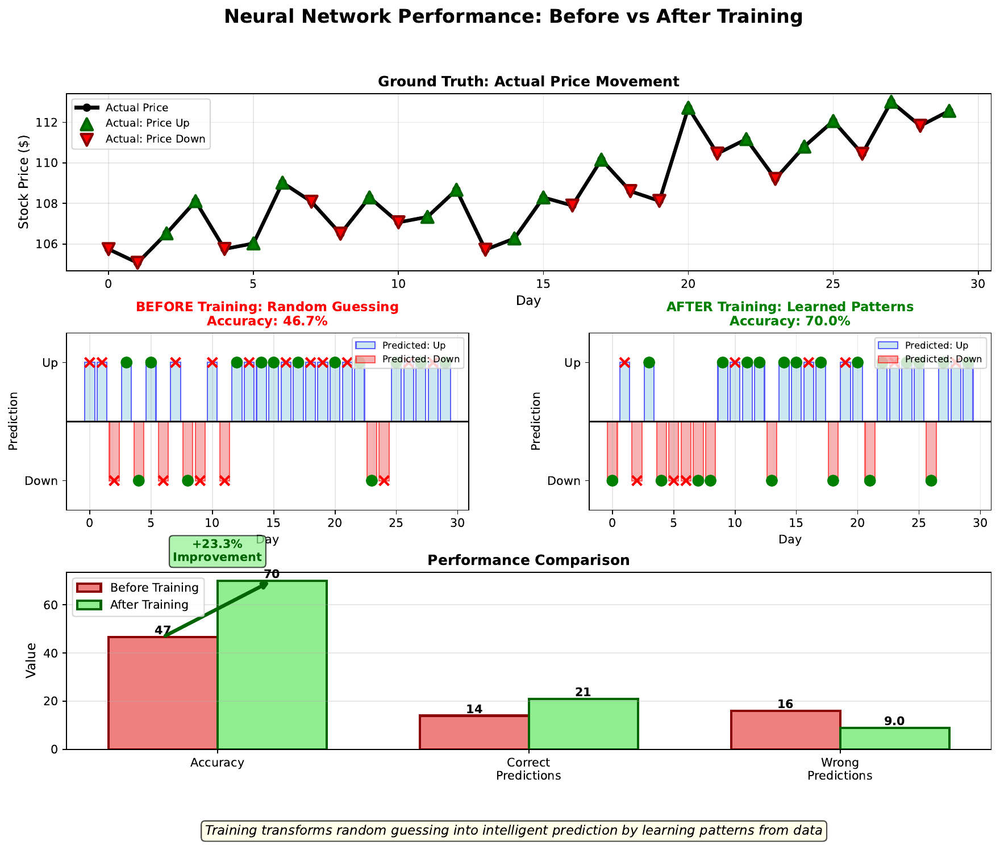

# Prediction Results

---

## Learning Goal

Compare network performance before and after training to understand the impact of learning.

---

## Key Concept

Before training, a neural network with random weights is essentially guessing. For binary classification (up/down), random guessing yields about **50% accuracy** - no better than flipping a coin.

After training on historical data, the network learns patterns that improve predictions. A well-trained network might achieve **70% accuracy** on unseen test data - significantly better than chance.

The improvement from 50% to 70% represents real predictive power extracted from the data. However, it's crucial to evaluate on **held-out test data** that wasn't used during training. Performance on training data is often inflated (the network may have memorized specifics rather than learning generalizable patterns).

Even modest accuracy improvements can be valuable in finance, where small edges compound over many trades.

---

## Visual

---

## Key Formula

**Accuracy:**
$$\text{Accuracy} = \frac{\text{Correct Predictions}}{\text{Total Predictions}} \times 100\%$$

**Improvement over baseline:**
$$\text{Improvement} = \text{Trained Accuracy} - \text{Random Baseline}$$

For binary classification:
$$\text{Random Baseline} = 50\%$$

---

## Intuitive Explanation

Imagine two weather forecasters:
- **Forecaster A** (random): Flips a coin to predict rain or shine
- **Forecaster B** (trained): Studies historical weather patterns

Over 100 days:
- Forecaster A: ~50 correct (coin flip)
- Forecaster B: ~70 correct (learned patterns)

Forecaster B adds real value by capturing patterns that random guessing misses. Similarly, a trained neural network extracts predictive information from data that raw chance cannot access.

---

## Practice Problems

### Problem 1
A trained network makes 140 correct predictions out of 200 test samples. Calculate: (a) accuracy, (b) improvement over random baseline.

Solution

**(a) Accuracy:**
$$\text{Accuracy} = \frac{140}{200} \times 100\% = 70\%$$

**(b) Improvement over baseline:**
$$\text{Improvement} = 70\% - 50\% = 20\%$$

The network predicts **20 percentage points** better than random guessing - a substantial improvement that could translate to profitable trading.

### Problem 2
Network A achieves 95% accuracy on training data but 52% on test data. Network B achieves 72% on training data and 68% on test data. Which network is better?

Solution

**Network B is better**, despite lower training accuracy.

Analysis:

**Network A:**
- Training: 95%, Test: 52%
- Gap: 43 percentage points
- Severe **overfitting** - memorized training data
- Test accuracy barely better than chance (52% vs 50%)

**Network B:**
- Training: 72%, Test: 68%
- Gap: 4 percentage points
- Good **generalization** - learned transferable patterns
- Test accuracy significantly better than chance

Network B's 68% test accuracy represents real predictive power. Network A's 95% training accuracy is misleading - it fails on new data.

### Problem 3
If a network achieves 55% accuracy on market direction, is it useful for trading?

Solution

**Potentially yes**, if statistically significant and transaction costs are low.

Analysis:

1. **Statistical significance**: With enough predictions, even 55% can be reliably above chance. Need to test with proper statistical methods.

2. **Edge calculation**: 55% win rate with equal-size wins/losses means positive expected value:
$$E[return] = 0.55 \times (win) + 0.45 \times (loss)$$
If wins = losses in magnitude: net positive

3. **Transaction costs**: Must exceed trading costs. 5% edge might disappear with 1% costs per trade.

4. **Compounding**: Small edges compound. 55% over 1000 trades can be highly profitable.

5. **Comparison**: Many successful quantitative strategies operate with 51-55% accuracy.

**Conclusion**: 55% accuracy can be valuable, but requires careful analysis of statistical reliability and costs.

---

## Key Takeaways

- Random guessing yields ~50% accuracy on binary classification
- Training extracts patterns that improve beyond baseline
- Always evaluate on held-out test data, not training data
- Even modest improvements (55-70%) can be valuable in finance
- Gap between training and test accuracy indicates overfitting
