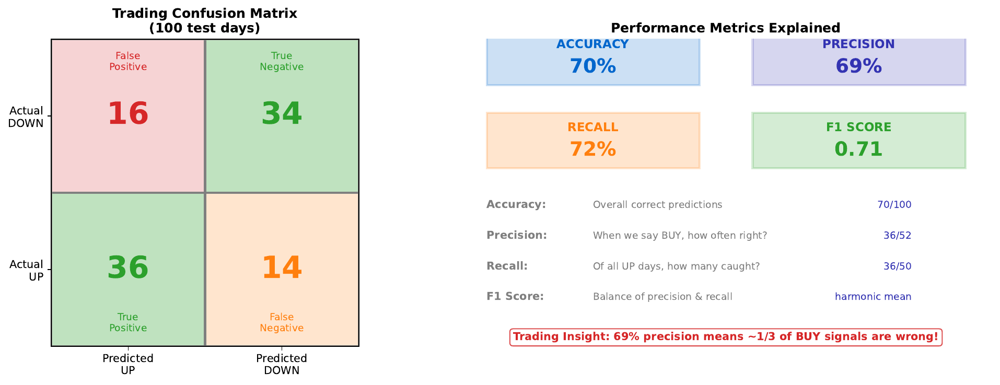

# Confusion Matrix

---

## Learning Goal

Evaluate classifier performance beyond simple accuracy using precision, recall, and F1 score.

---

## Key Concept

A **confusion matrix** breaks down predictions into four categories:
- **True Positive (TP)**: Predicted UP, actually UP
- **False Positive (FP)**: Predicted UP, actually DOWN (Type I error)
- **True Negative (TN)**: Predicted DOWN, actually DOWN
- **False Negative (FN)**: Predicted DOWN, actually UP (Type II error)

This granular view reveals important patterns that overall accuracy hides:
- **Precision**: When we predict UP, how often are we right?
- **Recall**: Of all actual UP days, how many did we catch?
- **F1 Score**: Harmonic mean of precision and recall

In trading, these distinctions matter: a false BUY signal (FP) costs money on a losing trade, while a missed opportunity (FN) is a foregone profit. Different strategies prioritize different metrics.

---

## Visual

---

## Key Formulas

**Precision** (positive predictive value):
$$\text{Precision} = \frac{TP}{TP + FP}$$

**Recall** (sensitivity, true positive rate):
$$\text{Recall} = \frac{TP}{TP + FN}$$

**F1 Score** (harmonic mean):
$$F_1 = 2 \times \frac{\text{Precision} \times \text{Recall}}{\text{Precision} + \text{Recall}}$$

**Accuracy**:
$$\text{Accuracy} = \frac{TP + TN}{TP + TN + FP + FN}$$

---

## Intuitive Explanation

Think of a spam filter:

- **High precision**: When it says "spam," it's almost always right. Few legitimate emails are blocked.
- **High recall**: It catches almost all spam. Few spam emails get through.

You can't maximize both simultaneously:
- More aggressive filtering = higher recall, lower precision
- More conservative filtering = higher precision, lower recall

In trading:
- High precision strategy: Trade rarely, but when you trade, usually win
- High recall strategy: Capture most winning opportunities, but also some losers

---

## Practice Problems

### Problem 1
Given: TP = 40, FP = 15, TN = 35, FN = 10. Calculate precision, recall, and F1 score.

Solution

**Precision:**
$$\text{Precision} = \frac{TP}{TP + FP} = \frac{40}{40 + 15} = \frac{40}{55} = 0.727 = 72.7\%$$

**Recall:**
$$\text{Recall} = \frac{TP}{TP + FN} = \frac{40}{40 + 10} = \frac{40}{50} = 0.800 = 80.0\%$$

**F1 Score:**
$$F_1 = 2 \times \frac{0.727 \times 0.800}{0.727 + 0.800} = 2 \times \frac{0.582}{1.527} = 0.762 = 76.2\%$$

**Accuracy (for reference):**
$$\text{Accuracy} = \frac{40 + 35}{40 + 15 + 35 + 10} = \frac{75}{100} = 75\%$$

### Problem 2
Model A: Precision = 90%, Recall = 50%. Model B: Precision = 70%, Recall = 70%. Which is better for a conservative trading strategy?

Solution

**Model A is better for conservative trading.**

**Why:**

**Model A (High precision):**
- When it says BUY, it's right 90% of the time
- Only catches 50% of opportunities
- Trades less frequently but with higher confidence
- Lower risk of losing trades

**Model B (Balanced):**
- When it says BUY, it's right 70% of the time
- Catches 70% of opportunities
- More trades, more wrong signals
- Higher risk but also catches more winners

**F1 comparison:**
- Model A: F1 = 2 * (0.90 * 0.50) / (0.90 + 0.50) = 0.643
- Model B: F1 = 2 * (0.70 * 0.70) / (0.70 + 0.70) = 0.700

By F1, Model B is "better" overall. But for conservative trading that prioritizes avoiding losses, Model A's 90% precision is preferable.

**Business context determines the right choice.**

### Problem 3
You increase the decision threshold from 0.5 to 0.8. How does this affect precision and recall?

Solution

**Higher threshold (0.8):**

**Effect on predictions:**
- Fewer predictions of "UP" (only high-confidence ones)
- More predictions of "DOWN" (default when uncertain)

**Effect on confusion matrix:**
- TP decreases (fewer BUY calls, so fewer correct BUYs)
- FP decreases (fewer BUY calls, so fewer wrong BUYs)
- TN increases (more SELL calls, so more correct SELLs)
- FN increases (more missed opportunities)

**Effect on metrics:**

**Precision**: Tends to **increase**
$$\text{Precision} = \frac{TP \downarrow}{TP \downarrow + FP \downarrow \downarrow}$$
FP typically decreases more than TP because marginal predictions are wrong.

**Recall**: **Decreases**
$$\text{Recall} = \frac{TP \downarrow}{TP \downarrow + FN \uparrow}$$
Fewer correct catches, more missed opportunities.

**Summary:** Higher threshold = more precise but less comprehensive.

---

## Key Takeaways

- Confusion matrix reveals four types of prediction outcomes
- Accuracy alone can be misleading (especially with imbalanced classes)
- Precision: "When I predict positive, am I right?"
- Recall: "Do I catch all the actual positives?"
- F1 balances precision and recall
- Choose metrics based on business costs of different errors
