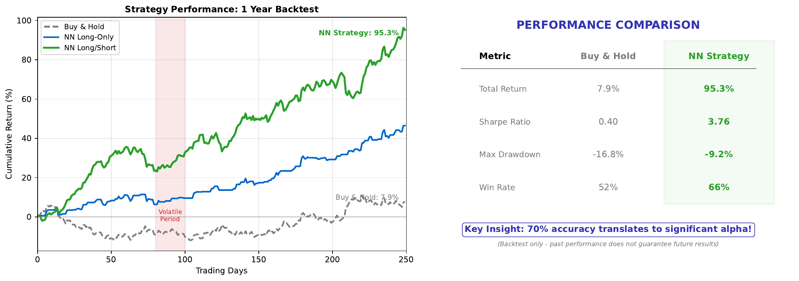

# Trading Backtest

---

## Learning Goal

Evaluate a neural network trading strategy against a buy-and-hold benchmark.

---

## Key Concept

A **backtest** simulates how a trading strategy would have performed on historical data. For neural network strategies, we compare:
- **Buy-and-hold**: Simply buy at start, hold throughout (benchmark)
- **NN strategy**: Trade based on model predictions (BUY when confidence > threshold)

The backtest reveals whether the model's predictions translate into actual profits. A 70% accurate model doesn't guarantee outperformance - transaction costs, timing, and magnitude of wins vs losses all matter.

Key metrics:
- **Cumulative returns**: Total profit over the period
- **Sharpe ratio**: Risk-adjusted returns
- **Maximum drawdown**: Largest peak-to-trough decline

The ultimate test: Does the strategy beat the benchmark after accounting for realistic trading costs?

---

## Visual

---

## Key Formulas

**Cumulative return:**
$$R_{total} = \prod_{t=1}^{T} (1 + r_t) - 1$$

**Sharpe ratio:**
$$\text{Sharpe} = \frac{\bar{r} - r_f}{\sigma_r}$$

Where:
- r-bar = mean return
- r_f = risk-free rate
- sigma_r = standard deviation of returns

**Maximum drawdown:**
$$\text{MDD} = \max_t \left( \frac{\text{Peak}_t - \text{Value}_t}{\text{Peak}_t} \right)$$

---

## Intuitive Explanation

Imagine two investors:

**Investor A (Buy-and-hold):** Buys stock on day 1 and holds for a year. No effort, no trading costs, captures all ups and downs.

**Investor B (NN strategy):** Uses a neural network to decide daily whether to be invested. Aims to be invested on "up" days and out on "down" days.

If Investor B has 70% accuracy:
- Captures 70% of "up" days (gains)
- Avoids 70% of "down" days (losses avoided)

But: Each trade costs money (commissions, spread). And perfect timing is impossible - predictions have some error.

The backtest answers: Does the accuracy advantage overcome the trading costs?

---

## Practice Problems

### Problem 1
Over 100 days: Buy-and-hold returns +15%. NN strategy has 60% accuracy with average daily return of +0.2% on correct UP predictions and -0.15% on incorrect predictions. Estimate NN strategy returns (ignoring costs).

Solution

**Expected daily return:**

Assume 50% of days are actually UP:
- 30 days: Predict UP, actually UP (60% of 50 UP days) -> +0.2% each
- 20 days: Predict UP, actually DOWN (40% of 50 DOWN days) -> -0.15% each
- 20 days: Predict DOWN, actually UP (40% of 50 UP days) -> 0% (not invested)
- 30 days: Predict DOWN, actually DOWN (60% of 50 DOWN days) -> 0% (not invested)

**Total return:**
$$R = 30 \times 0.2\% + 20 \times (-0.15\%) + 0 + 0$$
$$R = 6.0\% - 3.0\% = 3.0\%$$

Wait - this is worse than buy-and-hold's 15%!

**Why?** With only 60% accuracy, the strategy misses too many up days (20 missed) and still catches some down days (20 losses). The edge isn't strong enough.

**Lesson:** Accuracy alone doesn't guarantee profitability.

### Problem 2
Transaction cost is 0.1% per trade. The NN strategy trades 200 times over the year. How much do costs reduce returns?

Solution

**Transaction cost calculation:**

Total trades: 200
Cost per trade: 0.1%

**Total cost:**
$$\text{Costs} = 200 \times 0.1\% = 20\%$$

This is **20 percentage points** of returns lost to trading costs!

**Impact:**
- If strategy gross return = 25%, net return = 25% - 20% = 5%
- If strategy gross return = 15%, net return = 15% - 20% = -5% (loss!)

**Lesson:** High-frequency strategies need either very high accuracy or very low costs to be profitable.

**Solutions:**
- Trade less frequently (e.g., weekly signals)
- Use lower-cost brokers
- Only trade on high-confidence signals (threshold > 0.7)

### Problem 3
The NN strategy has maximum drawdown of 25% while buy-and-hold has 35%. Is this better? Why might an investor prefer lower drawdown?

Solution

**Yes, lower drawdown (25% vs 35%) is generally better.**

**Why investors care about drawdown:**

1. **Psychological**: Watching 35% of your portfolio disappear is painful and may cause panic selling at the worst time

2. **Recovery math**: A 35% loss requires +54% gain to recover; 25% loss needs only +33%
   - From $100: $65 needs to grow to $100 (+54%)
   - From $100: $75 needs to grow to $100 (+33%)

3. **Margin calls**: Large drawdowns may trigger forced liquidation

4. **Risk management**: Institutions have drawdown limits; exceeding them means job loss

5. **Compounding**: Avoiding big losses lets compounding work in your favor

**Trade-off:**
Lower drawdown strategies often have lower total returns. But many investors prefer:
- 12% return with 20% max drawdown over
- 15% return with 40% max drawdown

**Sharpe ratio** captures this: return per unit of risk.

---

## Key Takeaways

- Backtests simulate strategy performance on historical data
- Compare against buy-and-hold benchmark
- Transaction costs can eliminate prediction edge
- Accuracy doesn't guarantee profitability
- Consider risk metrics (drawdown, Sharpe) not just returns
- Realistic backtesting includes costs, slippage, and realistic assumptions

**Congratulations!** You've completed all 20 topics in the Neural Networks course.
